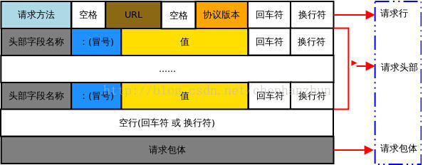
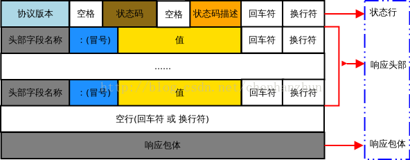

# TCP/IP协议族

## 分层
TCP/IP协议族从层次上来分， 从上到下分别是:应用层-->传输层-->网络层-->数据链路层
1. 应用层. 包括http协议,ftp协议等
2. 传输层. 包括TCP协议，UDP协议
3. 网络层. IP协议
4. 数据链路层. 为待传送的数据加入一个以太网协议头，并进行CRC编码，为最后的数据传输做准备

在经过每一层时，都会加上本层协议头部将请求进行封装。


## http
http请求方法包括POST, GET, HEAD, PUT, DELETE, CONNECT, OPTIONS, TRACE.

1. http请求


例子：
```
POST /meme.php/home/user/login HTTP/1.1  --->请求行
Host: 114.215.86.90  ---> 请求头
Cache-Control: no-cache ---> 请求头
Postman-Token: bd243d6b-da03-902f-0a2c-8e9377f6f6ed ---> 请求头
Content-Type: application/x-www-form-urlencoded ---> 请求头

tel=13637829200&password=123456 ---> 请求包体

```

2. http响应


例子：
```
HTTP/1.1 200 OK  --->状态行
Date: Sat, 02 Jan 2016 13:20:55 GMT  --->响应头部
Server: Apache/2.4.6 (CentOS) PHP/5.6.14 --->响应头部
X-Powered-By: PHP/5.6.14 --->响应头部
Content-Length: 78 --->响应头部
Keep-Alive: timeout=5, max=100 --->响应头部
Connection: Keep-Alive --->响应头部
Content-Type: application/json; charset=utf-8 --->响应头部

{"status":202,"info":"\u6b64\u7528\u6237\u4e0d\u5b58\u5728\uff01","data":null} ---> 响应包体

```

3. POST/GET
Get与Post区别本质就是参数是放在请求行中还是放在请求体中


## TCP/UDP
